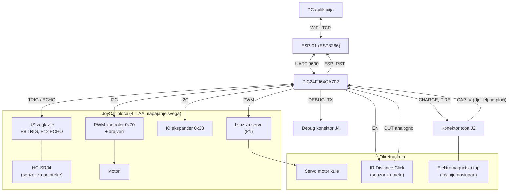
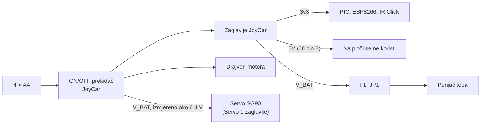

# Hardverska arhitektura
 
**Projekat:** Autonomna mobilna platforma sa integrisanim elektromagnetskim topom
**Verzija:** 0.9 (nacrt)
**Svrha:** Opis hardverskih blokova ploče, njihovih veza, napajanja i konektora. Tačne pinove, I2C adrese i protokol definiše dokument `hwsw-interface.md`, pa se ovdje ne ponavljaju.
 
**Šema i PCB:** KiCad 10, folder `hardware/Vihor` (šema u odjeljku 9, ploča u odjeljku 10), PDF šeme u `docs/Vihor.pdf`.
 
Vrijednosti označene sa **TBD** treba potvrditi mjerenjem ili datasheetom.
 
---
 
## 1. Pregled
 
Naša ploča (PCB) **zamjenjuje micro:bit** na JoyCar platformi: ubacuje se u ivični utor JoyCar ploče. JoyCar ploča već ima drajvere motora, senzore i vezu sa baterijama. Naša ploča ima mikrokontroler, WiFi modul, priključke za senzore, servo motor kule i interfejs za elektromagnetski top.
 
Osnovna pravila:
- Cijeli sistem radi sa **jednog izvora**, 4 × AA baterije na JoyCar ploči.
- Ploča **nema vlastite regulatore**: napone 3v3, 5V i V_BAT uzima sa zaglavlja JoyCar ploče.
- Motorima se upravlja komandama preko **I2C** (PIC je master).
- Top, senzor za metu i servo su na **okretnoj kuli**, a senzor za prepreke je fiksiran na šasiji.
---
 
## 2. Blok dijagram
 

```mermaid
flowchart TB
    APP["PC aplikacija"]
    ESP["ESP-01 (ESP8266)"]
    MCU["PIC24FJ64GA702"]
    CONN["Konektor topa J2"]
    DBG["Debug konektor J4"]
 
    subgraph JC["JoyCar ploča (4 × AA, napajanje svega)"]
        USH["US zaglavlje<br/>P8 TRIG, P12 ECHO"]
        HCSR["HC-SR04<br/>(senzor za prepreke)"]
        PWM["PWM kontroler 0x70<br/>+ drajveri"]
        IOX["IO ekspander 0x38"]
        MOT["Motori"]
        SRV["Izlaz za servo<br/>(P1)"]
    end
 
    subgraph KULA["Okretna kula"]
        SERVO["Servo motor kule"]
        IR["IR Distance Click<br/>(senzor za metu)"]
        TOP["Elektromagnetski top<br/>(još nije dostupan)"]
    end
 
    APP <-.->|"WiFi, TCP"| ESP
    ESP <-->|"UART 9600"| MCU
    MCU -->|"ESP_RST"| ESP
    MCU -->|"DEBUG_TX"| DBG
    MCU <-->|"I2C"| PWM
    MCU <-->|"I2C"| IOX
    PWM --> MOT
    MCU <-->|"TRIG / ECHO"| USH
    USH --- HCSR
    MCU -->|"PWM"| SRV
    SRV --> SERVO
    IR -->|"OUT analogno"| MCU
    MCU -->|"EN"| IR
    MCU -->|"CHARGE, FIRE"| CONN
    CONN -->|"CAP_V (djelitelj na ploči)"| MCU
    CONN --- TOP
```
 
---
 
## 3. Komponente
 
| Blok | Komponenta | Napon | Interfejs | Namjena |
|---|---|---|---|---|
| Mikrokontroler | PIC24FJ64GA702 (SOIC-28) | 3.3 V | I2C, UART, ADC, GPIO | Upravljanje, mašine stanja |
| WiFi | ESP8266 (ESP-01) | 3.3 V | UART, AT komande | Veza sa aplikacijom |
| Senzor za prepreke | HC-SR04 | 5 V | TRIG (linija u mirovanju na oko 5 V), ECHO (na P12 oko 3.3 V, preko čipa W1 na JoyCar ploči) | Detekcija prepreka, na šasiji |
| Senzor za metu | IR Distance Click (Sharp GP2Y0A60SZ0F) | 3.3 V | analogni OUT, EN | Detekcija mete, na kuli. Po datasheetu 10–150 cm, izmjereno pouzdano do oko 80 cm |
| Kula | Servo motor SG90 | oko 6.4 V sa zaglavlja Servo 1 (granica napona SG90 **TBD**) | PWM 50 Hz | Okretanje kule, izmjereni opseg oko 90° |
| Motori i drajveri | JoyCar ploča | V_BAT | I2C, 0x70 | Kretanje |
| Izvor | 4 × AA baterije | oko 4–6.4 V | zaglavlje | Napajanje svega |
| Top | Elektromagnetski top | **TBD** | CHARGE, FIRE, VCAP_SENSE | Gađanje, na kuli (još nije dostupan) |
 
Razlozi izbora su u `hwsw-interface.md`, odjeljak 1 i 3.1.
 
---
 
## 4. Napajanje
 
### 4.1 Struktura
 

```mermaid
flowchart LR
    B["4 × AA"] --> S["ON/OFF prekidač<br/>JoyCar"]
    S --> H["Zaglavlje JoyCar"]
    H -->|3v3| L["PIC, ESP8266, IR Click"]
    H -->|"5V (J6 pin 2)"| U["Na ploči se ne koristi"]
    H -->|V_BAT| F["F1, JP1"]
    F --> T["Punjač topa"]
    S --> M["Drajveri motora"]
    S -->|"V_BAT, izmjereno oko 6.4 V"| SV["Servo SG90<br/>(Servo 1 zaglavlje)"]
```
 
Naponi se ne stvaraju na našoj ploči: dolaze konektorom J6 (1 +3.3V, 2 +5V, 3 VBAT, 4 GND). Uz J6 je kondenzator C7 (10 µF), na mjestu gdje napon 3.3 V ulazi na ploču. HC-SR04 napaja JoyCar direktno preko US zaglavlja. Pitanje je **koliko struje zaglavlje JoyCar ploče može dati**.
 
### 4.2 Potrošači
 
Struje uglavnom nisu izmjerene (**TBD**), a treba ih provjeriti na prototipu:
- PIC24FJ64GA702 (3.3 V)
- ESP8266 (3.3 V), ima najveću potrošnju i skokove struje pri slanju
- IR Distance Click (3.3 V)
- HC-SR04 (5 V)
- Servo motor SG90: Servo 1 zaglavlje JoyCar ploče daje V_BAT (izmjereno oko 6.4 V); granica napona SG90 je **TBD**. Struja u pokretu oko 12–25 mA prosječno (na 5 V, bez opterećenja); vršna struja **TBD** (`hwsw-interface.md`, 3.2)
- Punjenje topa (V_BAT)
### 4.3 Rizici
 
- **Pad napona baterije.** Motori, servo i punjenje topa povlače veliku struju, pa napon može pasti i resetovati PIC. Zato punjenje topa ide ograničenom strujom i samo dok vozilo stoji, a napon baterije se mjeri na RA1.
- **Kapacitet zaglavlja 3v3.** ESP8266 pri slanju povlači strujne šiljke. Na ploči su zato C1–C3 uz ESP i C7 uz konektor J6. Da li je to dovoljno, provjerava se na prototipu.
- **Zajednička masa.** Sve komponente dijele GND sa JoyCar pločom, a uz napajanje svakog čipa ide kondenzator.
---
 
## 5. Pinovi
 
Potpuna tabela pinova je u `hwsw-interface.md`, odjeljak 3. Pregled grupa:
 
| Grupa | Pinovi | Veza |
|---|---|---|
| Programiranje | MCLR, RB0 (PGD1), RB1 (PGC1) | Programski konektor J3 |
| I2C (JoyCar) | RB8 (SCL1), RB9 (SDA1) | PWM kontroler 0x70, IO ekspander 0x38 |
| UART (WiFi) | RB12 (RX), RB13 (TX) | ESP8266 |
| HC-SR04 | RB6 (TRIG, preko R18), RB7 (ECHO, preko R13, INT0) | JoyCar US zaglavlje |
| IR Distance Click | RB2 (OUT, AN4), RB3 (EN) | Senzor za metu |
| Servo kule | RB14 (PWM) | JoyCar izlaz za servo (P1) |
| Baterija | RA1 (AN1) | JoyCar kontakt P2 |
| Top | RA0 (napon kondenzatora), RA3 (punjenje), RA4 (ispaljivanje), RB4 (rezerva) | Konektor topa |
| Korisnički | RB5 (dugme), RA2 (LED) | |
| WiFi reset | RB10 (ESP_RST) | RST modula ESP-01 |
| Debug | RB11 (DEBUG_TX) | Debug konektor J4 |
| Zujalica | RB15 (BUZZER) | JoyCar kontakt P16 (upotreba opciona) |
 
Pin za servo (RB14) je usklađen sa `software.md` i upisan u `hwsw-interface.md` (v0.22). Slobodnih pinova nema; rezerve su RB4 (rezervisan za top) i RB15 (zujalica, upotreba opciona).
 
---
 
## 6. Konektori i PCB
 
| Oznaka | Namjena | Pinovi |
|---|---|---|
| J5 | Ivični konektor (zlatni prsti), ulazi u micro:bit utor JoyCar ploče | 1 GND, 2 SDA, 3 SCL, 4 EDGE_3V, 5 BUZZER, 6 VBAT_SENSE, 7 ECHO, 8 TRIG, 9 SERVO_PWM |
| J6 | Napajanje sa JoyCar zaglavlja | 1 +3.3V, 2 +5V, 3 VBAT, 4 GND |
| J3 | Programski konektor | 1 MCLR, 2 +3.3V, 3 GND, 4 PGD1, 5 PGC1 |
| J4 | Debug konektor (UART, samo slanje) | 1 DEBUG_TX, 2 GND |
| U1 | ESP-01 | Utičnica 2 × 4 |
| J1 | IR Distance Click (senzor za metu) | 1 +3.3V, 2 GND, 3 IR_OUT, 4 IR_EN |
| J2 | Top | 1 VBAT (preko F1 i JP1), 2 GND, 3 TOP_CHARGE, 4 TOP_FIRE, 5 CAP_V, 6 TOP_RESERVE |
| JP1 | Kratkospojnik za odvajanje napajanja topa | 2 pina |
 
Raspored zlatnih prstiju (J5) je sa micro:bita: jezičak 51.6 mm, dubina 7.62 mm, prsti 1.0 × 7.0 mm (mjere iz datasheeta utora, potvrđene papirnom probom; zazor oko 1 mm).
 
Opis štampane ploče (dimenzije, slojevi, raspored, sastavljanje i puštanje u rad) je u odjeljku 10.

- Top, senzor za metu i servo su na kuli, pa kablovi do njih moraju biti savitljivi.
---
 
## 7. Top: interfejs
 
Top još nije dostupan, pa se unaprijed predviđa samo interfejs:
- **CHARGE** (izlaz): uključuje punjenje kondenzatora.
- **FIRE** (izlaz): okida ispaljivanje, samo uz potvrđeno punjenje.
- **VCAP_SENSE** (ulaz, ADC): napon kondenzatora preko razdjelnika. Na šemi su to djelitelj R5/R7 i zener dioda D1 (štiti ulaz RA0), vrijednosti **TBD**. Sa topa dolazi signal CAP_V (J2, pin 5).
- Pull-down otpornici R3 (TOP_CHARGE) i R4 (TOP_FIRE), 10k: drže linije na nuli dok ih PIC ne preuzme (reset, programiranje).
- Na napajanju topa su osigurač F1 (vrijednost **TBD**) i kratkospojnik JP1. Bleeder otpornik i prekidač nisu na šemi (**TBD**).
- Ograničenje napona kondenzatora (**TBD**).
- Kratkospojnikom JP1 se napajanje topa odvaja od ploče.
- Konektor topa je J2 (raspored u odjeljku 6).
---
 
## 8. Provjere na prototipu
 
| # | Šta provjeriti | Zašto |
|---|---|---|
| 1 | Napon i struja 3v3 i 5V zaglavlja pod opterećenjem (WiFi, motori, servo) | Da li zaglavlje izdržava sve potrošače |
| 2 | Pad napona baterije pod opterećenjem | Prag za zaštitu |
| 3 | Geometrija ivičnog konektora (razmak, širina i dužina prstiju) | Footprint |
| 4 | Napajanje i struja servo motora kule | Da li ga zaglavlje može napajati |
| 5 | Mjere i smjer prstiju micro:bita (širina, dužina, razmak od ivice, GND desno gledano sa prednje strane) | Footprint J5 |
 
---
 
## 9. Električna šema (KiCad)
 
Šema je u folderu `hardware/Vihor`, a PDF svih listova je u `docs/Vihor.pdf` (*File → Plot*, ponoviti nakon svake izmjene šeme).
 
### 9.1 Organizacija šeme
 
| List | Fajl | Sadržaj |
|---|---|---|
| Korijenski list | `Vihor.kicad_sch` | Naslovni list (naziv projekta, revizija, datum) sa dva hijerarhijska lista: „Blok šema“ i „Moduli“ |
| Blok šema | `blok_sema.kicad_sch` | Blok dijagram ploče: četiri bloka i signali između njih |
| Moduli | `moduli.kicad_sch` | Cijela električna šema, podijeljena okvirima na četiri bloka (9.2) |
 
Svi dijelovi su na jednom listu („Moduli“). Blokovi su grafički okviri, a veze između njih su labele: ista labela na dva mjesta znači istu vezu. Otvorena pitanja (**TBD**) upisana su u dnu svakog bloka.
 
**Nazivi veza:**
- napajanje: `+3.3V`, `+5V`, `VBAT`, `GND`
- programiranje: `MCLR`, `PGD1`, `PGC1`
- komunikacija: `UART_TX` (izlaz PIC-a, ide na RXD ESP-a), `UART_RX` (ulaz PIC-a, dolazi sa TXD ESP-a), `ESP_RST`, `DEBUG_TX`, `SDA`, `SCL`
- senzori: `TRIG`, `ECHO`, `IR_OUT`, `IR_EN`
- kula i top: `SERVO_PWM`, `TOP_CHARGE`, `TOP_FIRE`, `TOP_RESERVE`, `CAP_V` (sa topa), `VCAP_SENSE` (na RA0, iza djelitelja)
- ostalo: `VBAT_SENSE`, `BUZZER`, `LED`, `BTN`, `EDGE_3V`
 
### 9.2 Blokovi
 
Za svaki blok je opisano šta radi, kako je riješen i zašto, te šta je još otvoreno. Spisak svih dijelova sa vrijednostima i footprintima je u `components.md`, odjeljak 3, a pinovi PIC-a u `hwsw-interface.md`, odjeljak 3.
 
#### MCU i napajanje
 
**Uloga:** mikrokontroler IC1 (PIC24FJ64GA702) upravlja cijelim vozilom. Ovaj blok ima i ulaz napajanja ploče, konektore za programiranje i debug, dugme, statusnu LED i test tačke.
 
**Kako je riješeno:**
- **Napajanje** dolazi sa zaglavlja JoyCar ploče preko konektora J6 (1 +3.3V, 2 +5V, 3 VBAT, 4 GND). Ploča nema vlastitih regulatora, pa sve zavisi od JoyCar 3,3 V izlaza. Uz J6 je **C7 (10 µF)**, na mjestu gdje napon 3,3 V ulazi na ploču, da kratki padovi napona na žicama sa zaglavlja ne stignu do PIC-a i ESP-a. +5V je doveden, ali ga na ploči ne koristi nijedan dio (rezerva).
- **Kondenzatori uz PIC:** C4 (VDD, pin 13) i C6 (AVDD, pin 28), 100 nF, prigušuju kratke smetnje na napajanju i stoje što bliže pinovima. C5 (10 µF) na pinu VCAP (20) je obavezan kondenzator za unutrašnji regulator jezgre PIC-a; bez njega PIC ne radi.
- **Reset:** R10 (10k) drži MCLR na „1“, pa PIC normalno radi. Programator pri programiranju spušta MCLR i tako preuzima PIC.
- **Programski konektor J3** (1 MCLR, 2 +3.3V, 3 GND, 4 PGD1, 5 PGC1) služi za programiranje PIC-a na ploči (ICSP), preko pinova RB0 i RB1. Koristi se **PICkit 3**; raspored J3 je isti kao na programatoru, pa se on utakne direktno. Pri programiranju se ploča napaja sa JoyCar ploče, a ne iz programatora.
- **Dugme SW1** je spojeno na BTN (RB5) i GND, sa pull-up otpornikom R15 (10k): nepritisnuto je „1“, pritisnuto „0“. Na ploči nema kola za debounce, pa se odskakivanje kontakata rješava u firmveru.
- **Statusna LED D2** je na RA2, preko otpornika R9 (1k), koji ograničava struju na nekoliko mA.
- **Debug konektor J4** (1 DEBUG_TX, 2 GND): PIC preko RB11 (UART2) šalje poruke na računar kroz USB-UART adapter. Tako se firmver može pratiti i bez WiFi-ja, npr. dok veza sa ESP-om još ne radi.
- **Test tačke** TP1 (VBAT), TP2 (UART_TX), TP3 (UART_RX), TP4 (SDA), TP5 (SCL), TP6 (+3.3V) i TP7 (GND) služe za mjerenje na prototipu multimetrom, osciloskopom ili logičkim analizatorom.
 
**Otvoreno:** koliko struje daje JoyCar 3,3 V izlaz pod opterećenjem (**TBD**, mjerenje).
 
#### Ivični konektor
 
**Uloga:** preko konektora J5 naša ploča ulazi u micro:bit utor JoyCar ploče, umjesto micro:bita. Kroz njega idu signali prema JoyCar ploči: I2C prema motorima i senzorima, ultrazvučni senzor, servo kule, zujalica i napon baterije.
 
**Kako je riješeno:**
- **J5** ima 9 zlatnih prstiju, samo za kontakte koje koristimo: 1 GND, 2 SDA (P20), 3 SCL (P19), 4 EDGE_3V (3V), 5 BUZZER (P16), 6 VBAT_SENSE (P2), 7 ECHO (P12), 8 TRIG (P8), 9 SERVO_PWM (P1). Napajanje ploče ne ide kroz utor, nego preko J6. Mjere: jezičak 51.6 mm, dubina 7.62 mm, prsti 1.0 × 7.0 mm (mjere iz datasheeta utora, potvrđene papirnom probom; zazor oko 1 mm).
- **R13 (1k)** je u seriji na liniji ECHO. Izmjereno je da ECHO stiže na P12: između pina E na US zaglavlju i P12 je čip oznake W1 na JoyCar ploči, koji signal spušta na oko 3,3 V i u mirovanju aktivno drži liniju na nuli. Zato na liniji ECHO nema pull-up otpornika ni djelitelja napona (djelitelj bi spustio impuls ispod praga jedinice).
- **R18 (1k)** je u seriji na liniji TRIG. Linija je sa utaknutim senzorom u mirovanju na skoro 5 V, pa R18 ograničava struju u RB6.
- **R11 (0 Ω) i R12 (DNP)** su mjesto za djelitelj napona baterije (VBAT_SENSE). JoyCar već ima djelitelj na P2 (izmjereno oko 2,6 V pri 6,45 V, ispod 3,3 V), pa R11 služi kao obična veza, a R12 se ne ugrađuje. Ako bi napon ikad prelazio 3,3 V, na mjesto R11 se zalemi otpornik i ugradi R12, bez nove ploče.
- **R14 i R16 (DNP)** su mjesta za I2C pull-up otpornike na SDA i SCL. JoyCar ploča ih već ima (izmjereno), pa se ne ugrađuju.
- **R17 (0 Ω, DNP)** je premosnica između kontakta 3V u utoru (EDGE_3V) i +3.3V naše ploče. Nije provjereno da li JoyCar kroz taj kontakt daje napon ili ga očekuje od micro:bita. Dok se to ne provjeri, kontakt ostaje odvojen, da dva izvora od 3,3 V ne bi radila paralelno.
 
**Otvoreno:**
- smjer napajanja na kontaktu 3V (odluka o R17);
- sa koje strane ploče su prsti (**TBD**).
 
#### WiFi modul
 
**Uloga:** veza vozila sa aplikacijom na računaru. ESP-01 (U1) prima AT komande od PIC-a preko UART1 (UART_TX, UART_RX, 9600 baud) i komunicira sa računarom preko WiFi-ja.
 
**Kako je riješeno:**
- ESP-01 se utakne u **utičnicu 2 × 4**, pa se može izvaditi i pripremiti van ploče (upis AT firmvera, podešavanje brzine). Na ploči nema konektora za programiranje ESP-a.
- Pinovi **EN, IO0 i IO2** su pull-up otpornicima R1, R6 i R8 (10k) držani na „1“, jer modul samo tako startuje normalno. Sa IO0 na „0“ pri paljenju ulazi u režim za programiranje.
- **RST** ima pull-up R2 (10k), a spojen je i na PIC (ESP_RST, RB10). Ako modul prestane odgovarati, PIC ga može sam resetovati, bez gašenja vozila.
- Pri slanju ESP povlači kratke strujne šiljke do oko 300 mA. Kondenzatori **C1 (100 µF, elektrolitski, + na +3.3V), C2 (10 µF) i C3 (100 nF)** stoje uz napajanje modula, da napon 3,3 V ne propadne i ne resetuje modul ili PIC.
 
 
#### Senzori i top
 
**Uloga:** priključci za senzor za metu (IR Distance Click) i elektromagnetski top, koji su na okretnoj kuli, te zaštita i mjerenje za top.
 
**Kako je riješeno:**
- **J1** je konektor za IR Distance Click: 1 +3.3V, 2 GND, 3 IR_OUT (RB2, analogni ulaz), 4 IR_EN (RB3). Modul se napaja sa 3,3 V, da njegov izlaz ne pređe 3,3 V, koliko podnosi ADC PIC-a.
- **J2** je konektor topa: 1 VBAT, 2 GND, 3 TOP_CHARGE (RA3), 4 TOP_FIRE (RA4), 5 CAP_V, 6 TOP_RESERVE (RB4).
- **Napajanje topa** ide iz VBAT preko osigurača **F1** i kratkospojnika **JP1**. F1 štiti baterije i staze na ploči ako se u topu napravi kratak spoj. JP1 omogućava da se top fizički odvoji od napajanja: bez kapice top nema napajanje, npr. dok se ispituje ostatak vozila.
- **R3 i R4 (10k)** su pull-down otpornici na TOP_CHARGE i TOP_FIRE. Dok se PIC pali, resetuje ili programira, njegovi pinovi nisu ni na „0“ ni na „1“. Otpornici tada drže obje linije na „0“, pa top ne počne puniti niti opali slučajno.
- **R5 i R7** su djelitelj napona: smanjuju napon kondenzatora topa (CAP_V, viši od 3,3 V) na VCAP_SENSE, koji PIC mjeri na RA0 (ADC). Odnos se bira tako da pri najvećem naponu kondenzatora VCAP_SENSE ne pređe 3,3 V.
- **D1 (zener dioda)** štiti RA0: ako napon na VCAP_SENSE ipak poraste preko njenog napona (npr. zbog kvara ili pogrešnog djelitelja), dioda provodi i ograničava ga.
 
**Otvoreno:**
- napon i struja topa (kad se top dobije), a od njih zavise vrijednosti F1, R5, R7 i D1 (**TBD**);
- ako je napon kondenzatora visok, kroz J2 i R5 ide taj napon, pa konektor, otpornik i razmaci na ploči moraju biti predviđeni za njega (**TBD**);
- bleeder otpornik za pražnjenje kondenzatora i prekidač nisu na šemi (**TBD**).
 
### 9.3 Neugrađeni dijelovi (DNP)
 
| Oznaka | Vrijednost | Namjena |
|---|---|---|
| R12 | 10k | Donji dio djelitelja na VBAT_SENSE (uz R11 0 Ω) |
| R14, R16 | 10k | Pull-up na SDA i SCL (JoyCar ih već ima, ostaju neugrađeni) |
| R17 | 0 Ω | Premosnica između EDGE_3V i +3.3V (dok se ne provjeri smjer napajanja) |
 
Spisak svih dijelova sa vrijednostima i footprintima je u `components.md`, odjeljak 3.
 
**Stanje:** footprinti su dodijeljeni svim dijelovima (ivični konektor J5: `vihor:MicroBit_EdgeFingers_9`). Privremen je footprint za D1 (zener dioda: napon i tačan model još nisu izabrani, pa je footprint SOD-123 privremen). ERC je ponovljen u PR #47 (22.11.2026): bez grešaka. Ranije upozorenje o četiri žice spojene u jednoj tački (kod C1) odnosi se samo na preglednost crteža; isključene su provjere SPICE modela (šema se ne simulira) i slaganja footprinta sa filterima simbola.

---

## 10. Štampana ploča (PCB)

Ploča je projektovana u KiCadu 10 (`hardware/Vihor/Vihor.kicad_pcb`). Ulazi u micro:bit utor JoyCar ploče umjesto micro:bita, a napajanje dobija sa zaglavlja JoyCar ploče.

### 10.1 Osnovni podaci

| Stavka | Vrijednost |
|---|---|
| Dimenzije | 51.6 × 51.6 mm (donja ivica je jezičak za utor) |
| Broj slojeva | 2 (F.Cu gore, B.Cu dolje) |
| Debljina ploče | 1.6 mm (FR4), bakar 35 µm (1 oz) |
| Završna obrada | ENIG (i na zlatnim prstima) |
| Maska / natpisi | zelena / bijeli |
| Proizvođač | JLCPCB (Kina) |
| Verzija ploče | v1.0 |

### 10.2 Slojevi

| Sloj | Šta je na njemu |
|---|---|
| Gornji (F.Cu) | Svi dijelovi, većina signalnih vodova i bakarna površina spojena na +3.3V |
| Donji (B.Cu) | Bakarna površina spojena na GND i kratki prelazi vodova preko vija |

Svaka SMD masa (kondenzatori, IC1, otpornici prema GND) ima kratak vod do vije, koja je spaja sa GND površinom na donjoj strani.

### 10.3 Pravila izrade

Pravila su prilagođena mogućnostima JLCPCB-a, uz rezervu.

| Pravilo | Vrijednost |
|---|---|
| Najmanji razmak bakra | 0.2 mm |
| Najmanja širina voda | 0.2 mm |
| Najmanja vija | 0.7 mm (rupa 0.35 mm) |
| Bakar do ivice ploče | 0.5 mm (osim prstiju J5, koji idu do ivice) |
| Vija do voda | 0.3 mm |

| Klasa vodova | Mreže | Širina voda | Vija |
|---|---|---|---|
| Default | svi signali | 0.25 mm | 0.8 / 0.4 mm |
| Power | +3.3V, +5V, GND | 0.6 mm | 0.8 / 0.4 mm |
| VBAT_TOP | VBAT, VBAT_F, VBAT_TOP | 1.0 mm | 1.0 / 0.5 mm |

Dodatna pravila su u `hardware/Vihor/Vihor.kicad_dru`: prsti J5 smiju ići do ivice ploče i dijele jedan otvor u masci.

### 10.4 Raspored blokova

Gledano odozgo, sa jezičkom J5 dolje:

| Dio ploče | Šta je tu |
|---|---|
| Gore lijevo | ESP-01 (U1) u utičnici 2 × 4, sa C2, C3 i pull-up otpornicima R1, R2, R6 i R8. Antena modula izlazi preko gornje ivice ploče. |
| Gore u sredini | Programski konektor J3 i test tačke TP2, TP3, TP6 i TP7 (GND) |
| Gore desno | Debug konektor J4, dugme SW1, LED D2, konektor napajanja J6 |
| Sredina | PIC24FJ64GA702 (IC1) sa C4, C5 i C6 uz pinove napajanja i C1 (100 µF) |
| Desno | Konektor topa J2, osigurač F1, kratkospojnik JP1, R3, R4, R5, R7 i D1 |
| Lijevo | Konektor IR senzora J1 |
| Dolje | Red otpornika prema J5 (R11–R18) i zlatni prsti J5 |

Odluke pri projektovanju:
- **ESP-01 na gornjoj ivici:** antena je izvan ploče i što dalje od motora i baterija, a ispod antene nema bakra.
- **Kondenzatori uz PIC:** C6 (100 nF) je uz AVDD/AVSS (pinovi 28 i 27), C5 (10 µF) uz VCAP (pin 20), C4 (100 nF) uz VDD (pin 13). Kod pina 27 masa ide redom: pin → C6 → vija.
- **Širi vodovi za VBAT:** napajanje topa ide vodovima od 1.0 mm (J6 → F1 → JP1 → J2).
- **Otpornici uz J5:** serijski otpornici R13 (ECHO) i R18 (TRIG) i R11 (VBAT_SENSE) su odmah iznad prstiju, pa su vodovi prema JoyCar-u kratki.
- **Na jezičku nema vija ni bakarnih površina,** samo prsti i kratki vodovi od njih.

### 10.5 Ivični konektor J5

| Stavka | Vrijednost |
|---|---|
| Širina jezička | 51.6 mm (utor 52.06 mm) |
| Dubina jezička | 7.62 mm (do te linije nema dijelova) |
| Prsti | 9 prstiju 1.0 × 7.0 mm, samo na gornjoj strani (F.Cu) |
| Footprint | `vihor:MicroBit_EdgeFingers_9` |
| Zazor u utoru | oko 1 mm (papirna proba) |
| Strana prstiju u utoru | **TBD** (provjera u #46) |

Raspored signala na prstima je u odjeljku 6, a pozicije prema JoyCar kontaktima u `hwsw-interface.md`.

### 10.6 Konektori

| Oznaka | Namjena | Pin 1 → zadnji pin | Položaj |
|---|---|---|---|
| J1 | IR Distance Click | +3.3V, GND, IR_OUT, IR_EN | lijeva ivica |
| J2 | Top | VBAT_TOP, GND, TOP_CHARGE, TOP_FIRE, CAP_V, TOP_RESERVE | desna ivica, dolje |
| J3 | PICkit 3 | MCLR, +3.3V, GND, PGD1, PGC1 | gornja ivica, sredina |
| J4 | Debug UART | DEBUG_TX, GND | gornja ivica, desno |
| J5 | JoyCar utor | vidi odjeljak 6 | donja ivica |
| J6 | Napajanje sa JoyCar zaglavlja | +3.3V, +5V, VBAT, GND | desna ivica, gore |
| U1 | ESP-01 | utičnica 2 × 4 | gore lijevo |

Oznaka pina 1 na natpisu ploče: **TBD** (#46).

### 10.7 Test tačke

| Oznaka | Signal | Očekivano |
|---|---|---|
| TP1 | VBAT | oko 6.4 V sa punim baterijama (izmjereno 6.45 V) |
| TP2 | UART_TX (PIC → ESP) | 3.3 V u mirovanju |
| TP3 | UART_RX (ESP → PIC) | 3.3 V u mirovanju (samo sa ESP-01 u utičnici) |
| TP4 | SDA | 3.3 V u mirovanju (pull-up na JoyCar ploči) |
| TP5 | SCL | 3.3 V u mirovanju (pull-up na JoyCar ploči) |
| TP6 | +3.3V | 3.3 V |
| TP7 | GND | masa: tu se kači crna sonda (veća pločica sa rupom 1.0 mm) |

### 10.8 Kratkospojnik JP1

JP1 spaja napajanje topa (VBAT iza osigurača F1) sa konektorom J2. Bez kratkospojnika top nema napajanje, a ostatak ploče radi normalno.

JP1 se **skida**:
- kad top nije priključen,
- pri programiranju i prvom uključenju,
- pri bilo kakvom radu na topu (kondenzator topa može biti napunjen).

### 10.9 Sastavljanje

Redoslijed lemljenja:
1. IC1 (SOIC-28), pazeći na pin 1.
2. Otpornici i kondenzatori 0805, D2 (LED), F1 (1206).
3. Provjera kratkog spoja između +3.3V i GND (prije daljeg lemljenja).
4. SW1, konektori J1, J2, J3, J4, J6, JP1.
5. C1 (100 µF, radijalni).
6. Ženska letvica 2 × 4 za ESP-01.

Ne ugrađuju se (DNP): R12, R14, R16 i R17 (razlozi u odjeljku 9.3). Dijelovi za top (F1, R5, R7, D1) ugrađuju se kad se odrede vrijednosti (**TBD**).

Polaritet:
| Dio | Oznaka |
|---|---|
| IC1 | tačka ili zarez na kućištu = pin 1 (MCLR) |
| C1 | + na +3.3V (duža nožica) |
| D2 | katoda prema GND |
| D1 | katoda (traka) na VCAP_SENSE, anoda na GND |

### 10.10 Puštanje u rad

**Prije prvog napajanja** (multimetrom, ploča nije u JoyCar-u):
1. Nema kratkog spoja između +3.3V (TP6) i GND (TP7).
2. Nema kratkog spoja između VBAT (TP1) i GND (TP7).
3. Nema kratkog spoja između +5V (J6, pin 2) i GND.

**Prvo uključenje:**
1. ESP-01 nije u utičnici, JP1 je skinut.
2. Ploča u utoru JoyCar-a, kabl sa JoyCar zaglavlja na J6.
3. Uključiti JoyCar i izmjeriti TP6 (3.3 V) i TP1 (napon baterije) prema TP7 (GND).

**Programiranje:**
- PICkit 3 na J3. Pin 1 (MCLR) je označen strelicom na PICkit-u; raspored J3 odgovara PICkit-u 3 (pinovi 1–5).
- Ploča se napaja sa JoyCar-a, ne iz programatora (u MPLAB IPE isključiti napajanje iz alata).
- Program se upisuje iz MPLAB IPE.

**Priprema ESP-01** (prije stavljanja u utičnicu):
- AT firmver (ESP8266 NonOS AT Bin V1.7.4) i brzina 9600 baud (`AT+UART_DEF=9600,8,1,0,0`).
- Postupak je opisan u `hwsw-interface.md` (odjeljak o ESP-01).

**Prvi testovi:**
1. LED D2 (RA2) trepće.
2. Dugme SW1 (RB5) mijenja stanje LED-a.
3. I2C prema JoyCar-u: motori se okreću.
4. WiFi: ESP-01 se spaja na mrežu i šalje poruku TCP serveru.

Test programi u `firmware/tests/` su pisani za razvojnu ploču (dsPIC33), pa ih za PIC24 treba prilagoditi (**TBD**).

### 10.11 Proizvodnja

| Stavka | Vrijednost |
|---|---|
| Gerber i drill fajlovi | **TBD** (#42) |
| BOM i pozicije dijelova | **TBD** (#32, #42) |
| Postavke narudžbe | 2 sloja, 1.6 mm, ENIG, zelena maska, bijeli natpisi |
